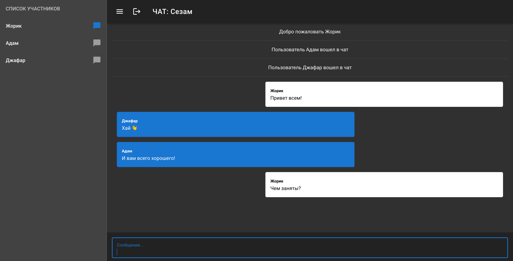

# Чат by Volkov I.I.

## Fullstack чат на Vue, Socket.io, Nuxt, Vuetify

### Для запуска приложения

- Склонировать проект
- Инициализировать проект - npm i
- Запустить проект - npm run dev
- Дождаться пока сервер запустится

# Сервер запустится по адресу localhost:3000

- В чате возможно создавать отдельные комнаты для группового чата
- Чат оповещает о том что юзер зашел или вышел

